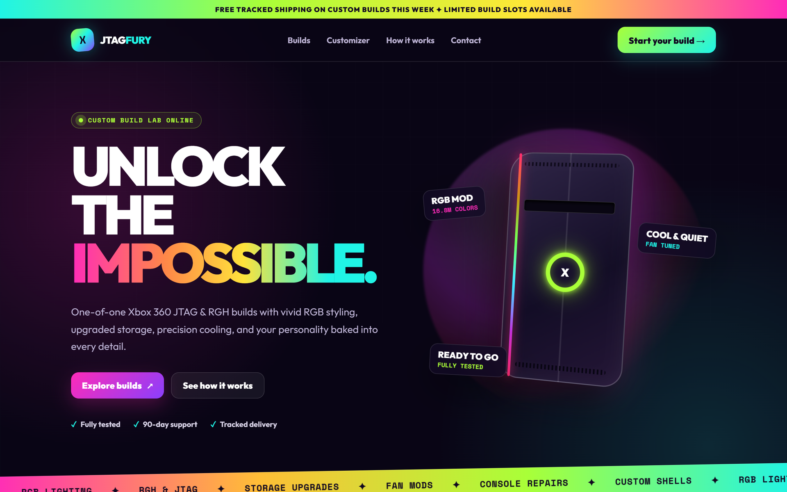
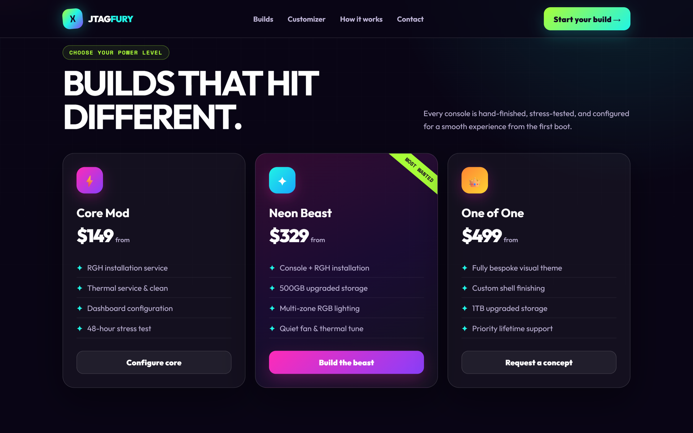

<p align="center">
  
</p>

<h1 align="center">JTAG Fury — Website Concept</h1>

<p align="center"><strong>Unlock the impossible.</strong></p>

<p align="center">
  Static storefront concept for custom Xbox 360 JTAG / RGH builds.<br>
  One <code>index.html</code>. No build step. Not a live shop.
</p>

<p align="center">
  <a href="https://github.com/ShugokiFable/Cool-Mod-Website-Concept/actions/workflows/ci.yml"></a>
  <a href="LICENSE"></a>
  
  
</p>

<p align="center">
  <a href="#open-the-page">Open the page</a>
  ·
  <a href="#what-you-get">What’s on the page</a>
  ·
  <a href="#honest-status">Honest status</a>
</p>

<p align="center">
  
</p>

<p align="center"><sub>Captured from <code>index.html</code> in this repository (local server, Microsoft Edge). Not a photograph of a real console.</sub></p>

## Why it exists

A full custom-console shop is a brand, a checkout, and a workshop. This file is the **front-of-house look**: neon, RGB, package cards, and a live price estimator — so the visual language can be judged without standing up a backend.

GitHub Pages is **not** published for this repo. Open the HTML locally.

## What you get

- Sticky nav, lime/cyan/purple mark, “Custom build lab online” hero
- CSS-only Xbox 360 stage (orb, RGB strip, LED ring) — no product photography
- Three packages: **Core Mod** ($149), **Neon Beast** ($329), **One of One** ($499)
- Customizer: console / storage / lighting / finish → estimated total
- Four-step process (Choose → Confirm → Build → Unleash)
- Mailto CTA to `builds@jtagfury.example` (placeholder, not a real inbox)
- Footer disclaimer: independent concept, not affiliated with Microsoft / Xbox

<p align="center">
  
</p>

<p align="center"><sub>Same capture pass, scrolled to <code>#builds</code>.</sub></p>

## Open the page

CSS and JS are inline. Google Fonts (Outfit, Space Mono) load from the network if you are online.

```powershell
git clone https://github.com/ShugokiFable/Cool-Mod-Website-Concept.git
cd Cool-Mod-Website-Concept
start index.html
```

Or serve it:

```powershell
python -m http.server 4173
```

Then open [http://127.0.0.1:4173](http://127.0.0.1:4173).

## Project map

```text
index.html          the entire site (markup, CSS, estimator JS)
.github/workflows   tidy (errors fail) + lychee offline link check
docs/images/        mark.svg, hero.png, builds.png
LICENSE             MIT
```

No npm, no bundler, no CMS.

## Development

CI on `main`:

```text
tidy -errors     HTML errors fail the job; warnings are tolerated
lychee --offline internal hrefs and anchors only
```

Edit `index.html`. Reload the browser.

## Honest status

Verified in this tree:

- single static page with working estimator and mailto draft
- screenshots above taken from that page
- CI workflow present

Not claimed:

- a real store, payments, inventory, or shipping
- GitHub Pages / live demo URL
- affiliation with Microsoft, Xbox, or any console manufacturer
- that JTAG / RGH modification is legal in your jurisdiction — the page is a design concept

## License

[MIT](LICENSE). Xbox and related marks belong to their owners. This is an unofficial concept.
